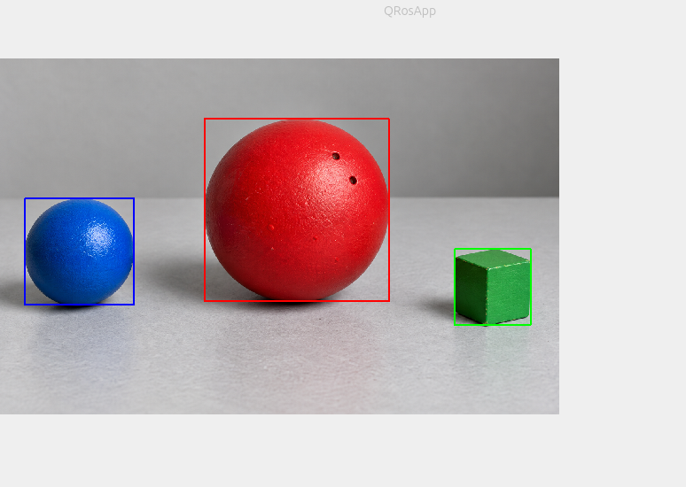

사용 기법 및 선택 이유

1. BGR에서 HSV 변환 

    BGR은 밝기가 바뀌면 전부 같이 변해서 색을 범위로 잡기 쉬운 HSV를 택했다.

2. inRange

    초록색 도형에서 하한을 40정도로 많이 낮췄는데 그 이유는 어두운 그림자 때문에 70정도로 높이면 통째로 어두운 면이 빠졌기 때문이다.

3. 형태학

    오프닝으로 작은 흰점 노이즈 제거하고 클로징으로 공 표면의 구멍이나 큐브 모서리 틈 같은거 구멍 매웠음.

4. 윤곽선 및 바운딩 박스

    RETR_EXTERNAL로 바깥 윤곽선 찾기, contourArea 로 형태학 한 후에도 남은 작은 덩어리들 거를려고 씀.
    
    
    